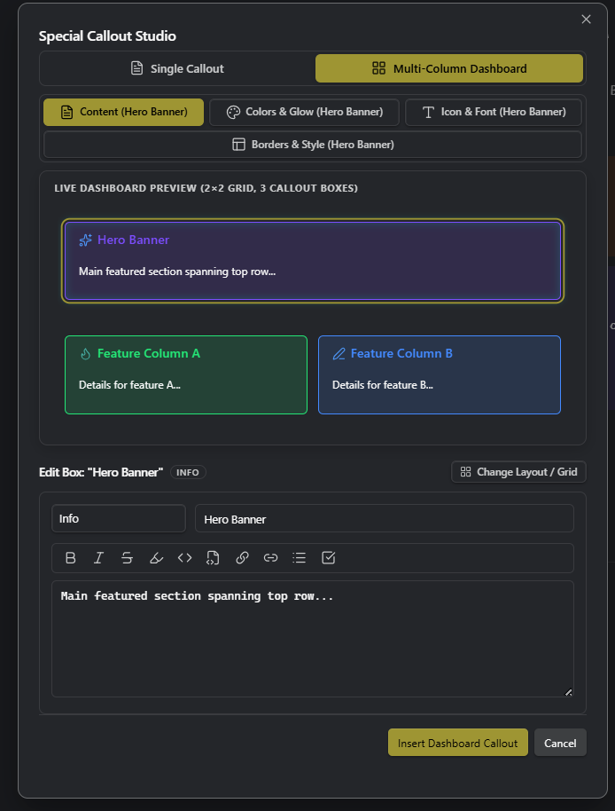
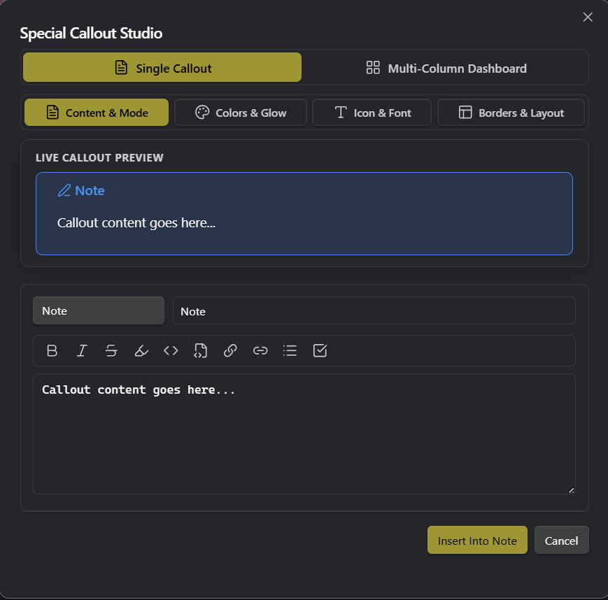

<p align="center">
  <a href="https://community.obsidian.md/plugins/special-callouts"></a>
  <a href="https://github.com/sponsors/RohitNahar-Offical"></a>
  
  
  
  
  
  
  <a href="skills/special-callouts/"></a>
</p>

<p align="center">
  <a href="USAGE_GUIDE.md">Usage Guide</a> · <a href="skills/special-callouts/">AI Agent Skill</a> · <a href="README_TR.md">Türkçe</a> · <a href="https://github.com/RohitNahar-Offical/special-callouts/issues">Report Bug</a> · <a href="https://github.com/sponsors/RohitNahar-Offical">❤️ Sponsor</a>
</p>

# Special Callouts Enhanced

> [!NOTE]
> **Fork Information**:
> This repository is an enhanced fork of the original [ahseyg/special-callouts](https://github.com/ahseyg/special-callouts) plugin by [ahseyg](https://github.com/ahseyg).
> It extends the core plugin with an interactive visual multi-column dashboard builder, true spanned CSS grid layouts, right-click context menu integration, full border styles, and memory/performance optimizations.
> 
> If you encounter any bugs or errors related to the upstream plugin, please open an issue with the original repository owner at **[ahseyg/special-callouts Issues](https://github.com/ahseyg/special-callouts/issues)**.

Transform your Obsidian notes with premium, dynamic, and fully customizable callouts. Turn generic boxes into magazine-quality layouts, code terminals, or neon-glowing alerts. Customize everything directly from your markdown — or create reusable presets in the visual settings panel.

**Open source** · MIT License · [Upstream Repo](https://github.com/ahseyg/special-callouts)

---

## ✨ What Makes This Enhanced Version Special?

* 🔲 **Visual Dashboard Designer**:
  * Build multi-column layouts and dashboard cards visually by clicking and dragging on a grid canvas — no complicated code needed!
  * Choose from 1-click presets like *Hero + 2 Columns*, *Workspace*, *3 Columns*, or *2×2 Grid*.
  * Customize colors, icons, glowing borders, and fonts for each box individually with a live preview.
* 👁️ **Flawless Live Preview & Reading View**:
  * Your custom icons, background colors, and layouts look **identical** whether you are typing in Editing Mode (Live Preview) or viewing in Reading View.
* 🖱️ **Right-Click Studio & Live Inserter**:
  * Right-click anywhere in your note to open the **Special Callout Studio**.
  * Pick icons, choose colors, customize borders, and see your changes in real-time before inserting them.
  * Includes a built-in formatting toolbar and autocomplete suggestions for `[[note links]]` and `#tags`.
* 🎨 **Glowing Neon Effects & Gradient Colors**:
  * Add ambient neon glow outlines (`neon:cyan`), smooth 2-color gradients (`gradient:purple-blue`), or custom border styles (dashed, dotted, double, etc.).
* 📋 **Multi-Column Lists (`col:N`)**:
  * Automatically split long bullet lists or checklist tasks into 2, 3, or 4 neat side-by-side columns (works seamlessly with Dataview queries too!).
* ⚡ **Lightning Fast & Memory Efficient**:
  * Engineered for zero lag, instant rendering, and automatic cleanup so your vault stays fast and lightweight no matter how many callouts you use.
* 📚 **Built-in Presets & Documentation**:
  * Includes ready-to-use recipes, full documentation in [`docs/`](docs/), and easy import/export so you can share your favorite styles across vaults.

---

## 🚀 Key Features

- ✍️ **Simple Markdown Syntax** — Customize backgrounds, borders, glow, and icons directly in your text (e.g. `> [!tip] (bg:#7c4dff, neon:cyan, icon:sparkles) Title`).
- 🎨 **Reusable Style Presets** — Design a style once in settings and apply it anywhere with `style:MyStyle`.
- 🔲 **Visual Grid Builder** — Drag-and-merge visual matrix designer for multi-panel dashboards.
- 📋 **Multi-Column Lists** — Turn vertical lists into balanced 2–4 column layouts (`col:3`).
- 🖱️ **Right-Click Studio** — Create and edit callouts with a live interactive modal.
- 🔤 **Typography & Fonts** — Choose from 5 font families and 5 scale sizes.
- 🖼️ **8 Border Styles** — Solid, dashed, dotted, double, groove, ridge, inset, and outset.
- ✨ **Neon Glow & Gradients** — Vibrant glowing borders and smooth color transitions.
- 📊 **Dataview Ready** — Dynamic query results automatically format into columns.
- 🔄 **Backup & Transfer** — Easily export and import your custom designs between vaults.

---

## Screenshots & Layout Capabilities

Explore the endless customization possibilities.

### 🎛️ Special Callout Studio & Visual Inserter

Create, customize, and preview single callouts and multi-column dashboard layouts in real time before inserting them into your notes:

| Multi-Column Dashboard Builder | Single Callout Studio |
| :---: | :---: |
|  |  |
| *Interactive multi-box matrix designer with live preview* | *Rich callout studio with markdown editor & toolbar* |

### Colors, Gradients and Effects


> [Learn how to create custom backgrounds and text colors in the Usage Guide](USAGE_GUIDE.md#colors--backgrounds)


> [Learn how to create gradient backgrounds in the Usage Guide](USAGE_GUIDE.md#gradient-background--gradient)


> [Learn how to create neon glowing effects in the Usage Guide](USAGE_GUIDE.md#visual-effects)

### Visual Layout Builder

Design complex dashboard grids by dragging and merging cells — no code required. Access from **Settings → Special Callouts → Visual Layout Builder**.


> [Learn how to use the Visual Layout Builder in the Usage Guide](USAGE_GUIDE.md#1-visual-layout-builder)

### Dashboard Grids

Use the visual builder or inline grid syntax to create multi-panel layouts. Callouts are automatically placed into the merged areas you designed.


> [Learn how to create Multi-Callout Dashboard Grids in the Usage Guide](USAGE_GUIDE.md#grid-layout-multi-callout)

### Typography and Borders


> [Learn how to change fonts and sizes in the Usage Guide](USAGE_GUIDE.md#typography)


> [Learn how to customize borders and radius in the Usage Guide](USAGE_GUIDE.md#borders--shapes)

### Multi-Column Lists


> [Learn how to split lists into multiple columns in the Usage Guide](USAGE_GUIDE.md#multi-column-lists)

---

## Metadata Reference

`> [!type] (param:value, param2:value2) Title`

### Colors
| Parameter | Example | Description |
| :--- | :--- | :--- |
| `bg` | `bg:#ff0000` | Background color |
| `text` | `text:white` | Content text color |
| `title` | `title:cyan` | Title and icon color |
| `link` | `link:orange` | Link color |
| `gradient` | `gradient:blue-purple` | Two-color gradient |
| `neon` | `neon:#00f2ff` | Neon border + glow |
| `icon` | `icon:sun` | Lucide icon name |
| `icon-color` | `icon-color:cyan` | Icon color (defaults to the title color) |
| `no-icon` | `(no-icon)` | Hide icon |

### Borders
| Parameter | Example | Description |
| :--- | :--- | :--- |
| `border-width` | `border-width:4` | Thickness (px) — `bw:` for short |
| `border-style` | `border-style:dashed` | `solid`, `dashed`, `dotted`, `double`, `groove`, `ridge`, `inset`, `outset` — `bs:` for short |
| `radius` | `radius:20` | Corner roundness (px) |

### Typography
| Parameter | Example | Description |
| :--- | :--- | :--- |
| `font` | `font:mono` | `mono`, `serif`, `sans`, `hand`, `marker` |
| `font-size` | `font-size:4` | `1` (tiny) → `5` (huge) |

### Layout
| Parameter | Example | Description |
| :--- | :--- | :--- |
| `col` | `(col:3)` | Multi-column lists |
| `center` | `(center)` | Center content |
| `compact` | `(compact)` | Reduce padding |
| `dense` | `(dense)` | Compact plus tighter line-height |
| Grid | `(1:2)` | Position in grid |

Full reference in the [Usage Guide](USAGE_GUIDE.md).

---

## AI Agent Skill

Let Claude write these callouts for you. **[skills/special-callouts/](skills/special-callouts/)** is an
[Agent Skill](https://docs.claude.com/en/docs/agents-and-tools/agent-skills/overview) covering the
plugin's complete syntax and real rendering behaviour — derived from the v1.0.9 source rather than
from the docs.

Install it by copying the folder into your skills directory:

```bash
cp -r skills/special-callouts ~/.claude/skills/
```

Then just describe what you want — "build a dashboard at the top of my daily note with my open
tasks", "split this list into three columns", "why is my callout background so faint?" — and it
produces correct markdown instead of plausible-looking guesses.

| File | Contents |
| :--- | :--- |
| [`SKILL.md`](skills/special-callouts/SKILL.md) | Syntax rules, the traps that make valid syntax look broken, debugging checklist |
| [`references/parameters.md`](skills/special-callouts/references/parameters.md) | Every parameter: accepted values, aliases, colour resolution, edge cases |
| [`references/layouts.md`](skills/special-callouts/references/layouts.md) | Multi-column lists, grids, custom visual layouts, Dataview |
| [`references/recipes.md`](skills/special-callouts/references/recipes.md) | Ready-made patterns and tested colour pairs |
| [`references/internals.md`](skills/special-callouts/references/internals.md) | Render pipeline, DOM/CSS contract, settings schema, known bugs |

Works with Claude Code, Claude Desktop and Claude.ai. `SKILL.md` is plain markdown, so any agent
framework that accepts a system prompt can use it too.

---

## Installation

### Community Plugins (Recommended)

1. **Settings → Community Plugins**
2. Turn off Restricted Mode
3. Browse → search **Special Callouts**
4. Install → Enable

Or open directly: [community.obsidian.md/plugins/special-callouts](https://community.obsidian.md/plugins/special-callouts)

### Manual

1. Download `main.js`, `styles.css`, `manifest.json` from the [latest release](https://github.com/ahseyg/special-callouts/releases)
2. Create `VaultFolder/.obsidian/plugins/special-callouts/`
3. Copy the files into the folder
4. Enable in Settings → Community Plugins

---

## Contributing & Issues
 
 - **Bug reports & Errors:** Please report errors and issues directly to the original owner at [ahseyg/special-callouts Issues](https://github.com/ahseyg/special-callouts/issues) — include Obsidian version, callout markdown, and a screenshot.
 - **Feature requests:** [Open an upstream issue](https://github.com/ahseyg/special-callouts/issues)
 - **Pull requests:** Fork → Branch → Code → PR

If you find this plugin useful, consider giving it a [star](https://github.com/ahseyg/special-callouts).

---

## ❤️ Support Development

If you enjoy using Special Callouts and want to support its continued development, please consider becoming a sponsor!

<a href="https://github.com/sponsors/RohitNahar-Offical">
  
</a>

---

## License

MIT — See [LICENSE](LICENSE) for details.
