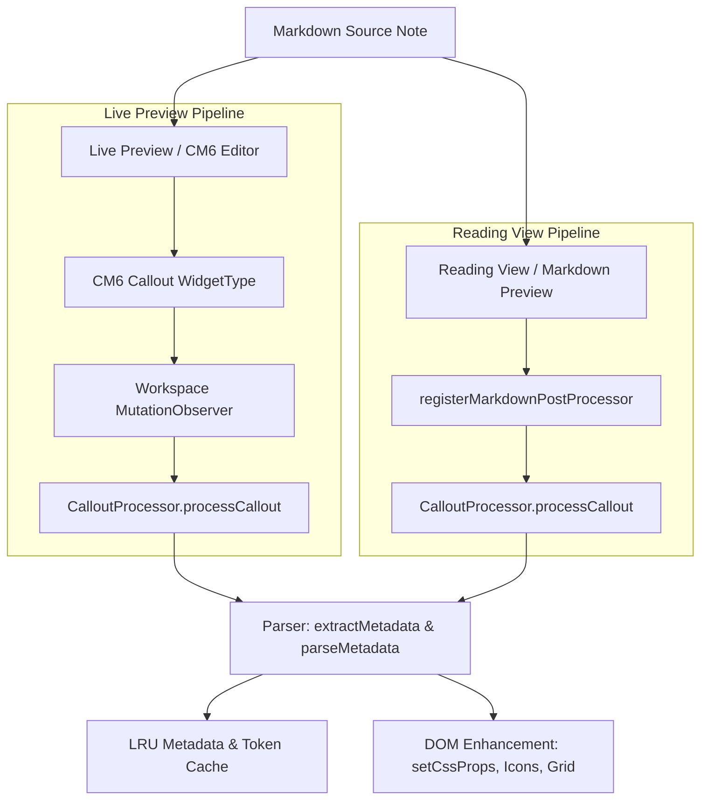

# Core Architecture & Dual-Engine Rendering

## 1. High-Level Architectural Overview

Special Callouts enhances Obsidian's native callout system (`> [!type]`) with metadata-driven visual effects, responsive flex/grid layouts, list columns, and custom icons.

The core challenge in Obsidian is that the app operates under **two completely different rendering paradigms**:
1. **Reading View (Markdown Preview)**: Static HTML parsed and built once (or on save) inside `.markdown-preview-section`.
2. **Editing View (Live Preview / Source Mode)**: Dynamic, virtualized CodeMirror 6 (CM6) editor where Callout blocks are rendered as interactive `WidgetType` decorations that are mounted, recycled, and destroyed as the viewport scrolls or the cursor moves.

---

## 2. The Dual-Engine Pipeline: How & Why

### The Problem
If a plugin only relies on `registerMarkdownPostProcessor`, it works in Reading View, but **fails in Live Preview**. CodeMirror 6 uses virtual scrolling and creates/destroys DOM widgets dynamically without invoking the markdown post-processor on recycled nodes.

### The Solution
Special Callouts employs a dual-trigger architecture:

1. **`registerMarkdownPostProcessor` in [main.ts](file:///r:/Obsidian/Testsub1/.obsidian/plugins/special-callouts/main.ts)**:
   - Captures rendered sections in Reading View and initial blocks in Live Preview.
   - Safely collects root elements if the passed container itself has class `.callout`.
2. **Continuous Workspace `MutationObserver` in [main.ts](file:///r:/Obsidian/Testsub1/.obsidian/plugins/special-callouts/main.ts)**:
   - Listens to `document.body` for newly appended `.callout` DOM nodes.
   - Instantly intercepts CodeMirror 6 widget mounts (within 0ms) and invokes `processor.processCallout(node)`.

---

## 3. The Lifecycle of `processCallout()`

When `processCallout(calloutEl)` receives a `.callout` element, it executes a strict, high-performance sequence:

1. **Outer Wrapper Isolation**:
   - If `calloutEl` is `data-callout="multi-callout"`, it hides its own header (`:scope > .callout-title`) and skips metadata parsing so it **never steals child sub-callout titles**.
2. **Direct-Child Title Resolution**:
   - Queries `:scope > .callout-title` to avoid grabbing nested descendant titles.
3. **Safe Text Node Isolation**:
   - Isolates title text inside `.callout-title-inner` without wiping sibling nodes (`.callout-icon`, `.callout-fold`).
4. **Zero-Allocation Cache Check**:
   - Computes `cacheKey = `${type}_${pipeMeta}_${fullText}_${storedMeta}``.
   - If `processedElements.get(calloutEl) === cacheKey`, execution returns in $O(1)$ without doing redundant work.
5. **$O(1)$ Hash Map Style Lookups**:
   - Checks precomputed `modifiedStandardStyles` and `customStylesMap` HashMaps.
6. **Metadata Extraction & Sanitization**:
   - Calls `extractMetadata()` using an LRU-bounded token cache.
   - Strips `(metadata)` from text nodes recursively while preserving child formatting spans.
   - Stores extracted metadata in `data-sc-meta` so subsequent re-renders in Live Preview never lose configuration.
7. **Batched CSS Variable Injection**:
   - Applies styles using `calloutEl.setCssProps({...})` in a single batched operation.
8. **Icon Mounting**:
   - Sets `--callout-icon` for Live Preview.
   - Invokes `forceApplyIcon()` with a 3-layer persistence mechanism for Reading View.
