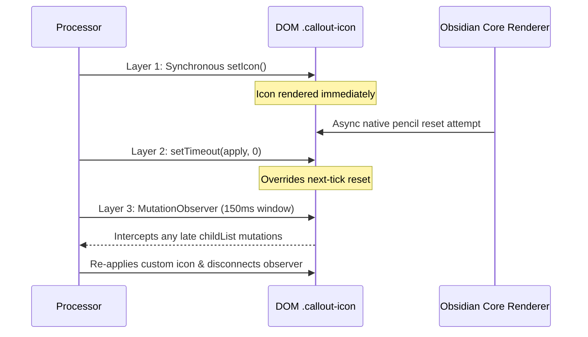

# Lifecycle, Observers & Async Resilience

Special Callouts employs three specialized observer systems to ensure complete layout stability and prevent memory leaks.

---

## 1. The 3-Layer `forceApplyIcon` Architecture

### The Problem
When rendering custom callout icons, Obsidian's native callout renderer often triggers an asynchronous post-render pass that attempts to reset the icon to the default `pencil` icon.

### The 3-Layer Defense
In [src/processor.ts](file:///r:/Obsidian/Testsub1/.obsidian/plugins/special-callouts/src/processor.ts), `forceApplyIcon()` implements three distinct synchronization layers:



```ts
private forceApplyIcon(iconEl: HTMLElement, iconName: string): void {
    if (!iconEl || !iconName) return;

    const apply = () => {
        iconEl.empty();
        setIcon(iconEl, iconName);
        if (!iconEl.querySelector('svg')) {
            const alt = iconName.startsWith('lucide-') ? iconName.slice(7) : `lucide-${iconName}`;
            setIcon(iconEl, alt);
        }
        iconEl.removeClass('sc-hidden');

        // SMIL animated SVG scroll recovery support
        const svg = iconEl.querySelector('svg');
        if (svg) {
            svg.addClass('svg-icon');
            if (svg.querySelector('animate, animateTransform, set')) {
                this.trackAnimatedSvg(svg as unknown as SVGElement);
            }
        }
    };

    // Layer 1: Apply immediately
    apply();

    // Layer 2: Next tick override for Obsidian's post-render pencil reset
    window.setTimeout(() => {
        apply();
    }, 0);

    // Layer 3: Short-lived MutationObserver to intercept delayed native DOM resets
    if (typeof MutationObserver !== 'undefined') {
        const observer = new MutationObserver(() => {
            observer.disconnect();
            apply();
        });
        observer.observe(iconEl, { childList: true });
        window.setTimeout(() => observer.disconnect(), 150);
    }
}
```

---

## 2. SMIL Animated SVG Lifecycle & Scroll Recovery

### Chromium SMIL Off-Screen Throttling
Chromium suppresses SMIL time event dispatches (`endEvent`) when elements scroll off-screen. This permanently breaks chained syncbase animation loops (e.g. `begin="0;prev.end+0.15s"`).
Calling `unpauseAnimations()` or `setCurrentTime(0)` on an already-evaluated SVG cannot recover broken chained syncbases.

### The Recovery Mechanism
Special Callouts caches a template of the SVG in a `WeakMap<SVGElement, SVGElement>`. An `IntersectionObserver` detects when the animated icon scrolls back into the visible viewport and replaces the stalled SVG with a freshly cloned template node:

```ts
private trackAnimatedSvg(svg: SVGElement): void {
    if (!this.animatedSvgObserver && typeof IntersectionObserver !== 'undefined') {
        this.animatedSvgObserver = new IntersectionObserver((entries) => {
            entries.forEach((entry) => {
                if (entry.isIntersecting) {
                    const targetSvg = entry.target as SVGElement;
                    const template = this.svgTemplates.get(targetSvg);
                    if (template && targetSvg.parentElement) {
                        const fresh = template.cloneNode(true) as SVGElement;
                        this.svgTemplates.set(fresh, template);
                        this.animatedSvgObserver?.unobserve(targetSvg);
                        targetSvg.parentElement.replaceChild(fresh, targetSvg);
                        this.animatedSvgObserver?.observe(fresh);
                    }
                }
            });
        });
    }

    if (!this.svgTemplates.has(svg)) {
        const template = svg.cloneNode(true) as SVGElement;
        this.svgTemplates.set(svg, template);
    }
    this.animatedSvgObserver?.observe(svg);
}
```

---

## 3. List Multi-Column Dynamic Retry & Observer

For plugins like **Dataview**, **Tasks**, and **Homepage**, markdown lists inside callouts are populated asynchronously after initial DOM mounting.

1. **Initial Microtask Check**: `applyColumnsToContainer()` runs via `window.requestAnimationFrame`.
2. **Single Lightweight Fallback**: `scheduleColumnRetry()` registers a single 120ms fallback timer with lifecycle tracking (cleared if re-triggered or if the element is disconnected).
3. **Content `MutationObserver`**: `setupObserver()` tracks character and childList mutations inside `.callout-content`, ensuring dynamic queries automatically reflow without manual user reloads.
