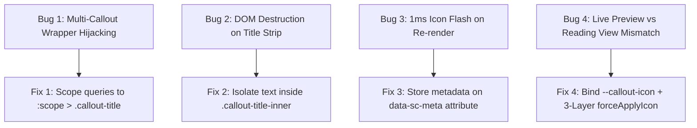

# Troubleshooting, Known Gotchas & Architectural Decisions

This document details the critical edge cases, subtle lifecycle gotchas, and specific bug diagnoses that were solved in the Special Callouts rendering engine.

---

## 🔍 Case Study: The Multi-Stage Icon Lifecycle & Dual-View Synchronization

During the evolution of the plugin, callout icons exhibited several complex failure modes across Reading View and Editing Mode (Live Preview). Below is the comprehensive breakdown of each root cause and its architectural solution.



---

### 1. Root Cause 1: Outer Multi-Callout QuerySelector Hijacking Child Titles

#### The Symptom
When rendering a multi-callout dashboard (e.g. Hero Banner, Feature A, Feature B), none of the child callout boxes showed their icons or styles in the live note, even though the Studio preview modal rendered them correctly.

#### The Diagnosis
In [main.ts](file:///r:/Obsidian/Testsub1/.obsidian/plugins/special-callouts/main.ts), the post-processor iterates over all `.callout` elements in DOM tree order. The first element is the outer container `<div class="callout" data-callout="multi-callout">`.

Inside `processCallout(outerMultiCallout)`:
```ts
// ❌ BUG: Unscoped query searches descendants into child sub-callouts
const titleEl = calloutEl.querySelector('.callout-title');
```
Because the outer container's title was hidden, `querySelector('.callout-title')` traversed down into the **first child callout** ("Hero Banner")!
1. The outer multi-callout stripped the metadata `(1-2:2:1, icon:sparkles)` from "Hero Banner".
2. When the loop reached "Hero Banner" itself, its title was already `"Hero Banner"` without parentheses.
3. The fast-path check `if (!pipeMetadata && !fullText.includes('('))` hit and **aborted processing**, leaving "Hero Banner" completely unstyled and without its icon!

#### The Solution
1. Outer `multi-callout` containers are isolated immediately:
   ```ts
   if (calloutType === 'multi-callout') {
       const titleEl = calloutEl.querySelector(':scope > .callout-title') as HTMLElement | null;
       if (titleEl) titleEl.addClass('sc-hidden');
       return; // Do not touch child titles!
   }
   ```
2. All title queries are strictly scoped to `:scope > .callout-title`.

---

### 2. Root Cause 2: Destructive `.textContent` Wiping of `.callout-icon`

#### The Symptom
Callout title text was rendered flush against the left border with zero icon spacing, and the `<div class="callout-icon">` element was entirely absent from the DOM.

#### The Diagnosis
Obsidian callouts often render the header without a `.callout-title-inner` wrapper:
```html
<div class="callout-title">
    <div class="callout-icon"><svg>...</svg></div>
    (1-2:2:1, bg:#7c4dff, icon:sparkles) Hero Banner
</div>
```
When `innerTitleEl` was `titleEl` (`.callout-title`), executing:
```ts
innerTitleEl.textContent = extracted.title; // ❌ Overwrote entire .callout-title!
```
Setting `.textContent` on `.callout-title` **obliterated all child DOM nodes**, instantly deleting `<div class="callout-icon">` from the document.

#### The Solution
1. In `processCallout()`, text nodes are safely isolated into a `.callout-title-inner` span:
   ```ts
   let innerTitleEl = (titleEl.querySelector(':scope > .callout-title-inner') || titleEl.querySelector('.callout-title-inner')) as HTMLElement | null;
   if (!innerTitleEl) {
       innerTitleEl = titleEl.createSpan({ cls: 'callout-title-inner' });
       const nodesToMove: Node[] = [];
       for (let i = 0; i < titleEl.childNodes.length; i++) {
           const child = titleEl.childNodes[i];
           if (child !== innerTitleEl && !(child instanceof HTMLElement && (child.classList.contains('callout-icon') || child.classList.contains('callout-fold')))) {
               nodesToMove.push(child);
           }
       }
       nodesToMove.forEach(node => innerTitleEl!.appendChild(node));
   }
   ```
2. Metadata stripping is performed recursively on `TEXT_NODE`s without touching sibling elements.

---

### 3. Root Cause 3: The 1-Millisecond Icon Flash (Pass 2 Re-render Cache Gotcha)

#### The Symptom
On note reload or tab switch, callout icons appeared for a millisecond, then vanished.

#### The Diagnosis
1. **Pass 1 (Initial Render)**:
   - Post-processor ran -> metadata was parsed -> `forceApplyIcon` mounted the SVG icon.
   - The icon was **visible on screen**.
   - Post-processor sanitized the title text node from `(icon:sparkles) Hero Banner` to `Hero Banner`.
2. **Pass 2 (1ms later)**:
   - Modifying the DOM text node triggered Obsidian's internal renderer / CodeMirror to re-synchronize the callout container.
   - When `processCallout()` was called on the re-synchronized element, `fullText` was now `"Hero Banner"` (parentheses were already removed in Pass 1).
   - The fast-path check `if (!pipeMetadata && !fullText.includes('('))` assumed the callout had no metadata and **exited immediately**.
   - The re-synchronized DOM lacked the custom icon, and because Pass 2 returned early, the icon was never re-applied.

#### The Solution
- When metadata is parsed in Pass 1, it is stored on the element: `calloutEl.setAttribute('data-sc-meta', currentExtractedMeta)`.
- `processCallout()` checks both `fullText` and `storedMeta`. When Pass 2 runs, it recovers the configuration from `data-sc-meta` and re-mounts the icon permanently.

---

### 4. Root Cause 4: Reading View vs Editing Mode (Live Preview) Dual-Engine Divergence

#### The Symptom
The custom icon appeared correctly in Reading View, but in Editing Mode (Live Preview), Obsidian showed the default icon (like `pencil`) or no icon at all.

#### The Diagnosis
1. **Reading View**: Uses static HTML where injected `<svg>` elements inside `.callout-icon` display directly.
2. **Live Preview (CodeMirror 6)**: The CM6 Callout widget reads the CSS custom property `--callout-icon` directly on the container.
3. If `--callout-icon` was not bound to the element, Live Preview continued using the default callout type's icon.
4. Furthermore, invasive CSS rules like `mask: none !important; background: none !important;` destroyed Obsidian core's native mask-based icon renderer in Live Preview.

#### The Solution
1. **Dynamic CSS Variable Binding (`src/processor.ts`)**:
   ```ts
   if (config.icon) {
       cssProps['--callout-icon'] = config.icon;
       this.forceApplyIcon(iconEl, config.icon);
   }
   ```
   - Live Preview consumes `cssProps['--callout-icon']` to render the custom icon mask.
   - Reading View consumes `forceApplyIcon(iconEl, config.icon)` to render the Lucide SVG.
2. **3-Layer `forceApplyIcon` Architecture**:
   - **Layer 1**: Immediate `setIcon()` call.
   - **Layer 2**: `setTimeout(..., 0)` to override Obsidian core's next-tick default pencil reset.
   - **Layer 3**: 150ms `MutationObserver` on `iconEl` to intercept delayed native DOM resets without memory leaks.
3. **Clean Non-Destructive CSS (`styles.css`)**:
   - Removed all invasive mask overrides from `.callout .callout-icon`, allowing Obsidian core to render both native masks and injected SVGs with 100% fidelity.

---

## 5. Summary Matrix of Resolutions

| Issue | Root Cause | Architectural Fix | Files Involved |
| :--- | :--- | :--- | :--- |
| **Missing Dashboard Icons** | Outer `multi-callout` querySelector matched child headers | Scoped queries to `:scope > .callout-title` + multi-callout early return | [src/processor.ts](file:///r:/Obsidian/Testsub1/.obsidian/plugins/special-callouts/src/processor.ts) |
| **Erased Icon DOM Element** | `titleEl.textContent = ...` wiped all child elements | Isolated text inside `.callout-title-inner` span | [src/processor.ts](file:///r:/Obsidian/Testsub1/.obsidian/plugins/special-callouts/src/processor.ts) |
| **1ms Icon Flash & Vanish** | Title mutation triggered Pass 2 where `fullText` had no `(...)` | Stored metadata in `data-sc-meta` attribute for state retention | [src/processor.ts](file:///r:/Obsidian/Testsub1/.obsidian/plugins/special-callouts/src/processor.ts) |
| **Live Preview Icon Mismatch** | CM6 Live Preview widget reads `--callout-icon` variable | Bound `cssProps['--callout-icon'] = config.icon` + 3-layer `forceApplyIcon` | [src/processor.ts](file:///r:/Obsidian/Testsub1/.obsidian/plugins/special-callouts/src/processor.ts), [styles.css](file:///r:/Obsidian/Testsub1/.obsidian/plugins/special-callouts/styles.css) |
| **Live Preview Unprocessed Widgets** | CM6 virtual DOM recycling bypassed post-processor | Global `MutationObserver` on `document.body` tracking `.callout` additions | [main.ts](file:///r:/Obsidian/Testsub1/.obsidian/plugins/special-callouts/main.ts) |
