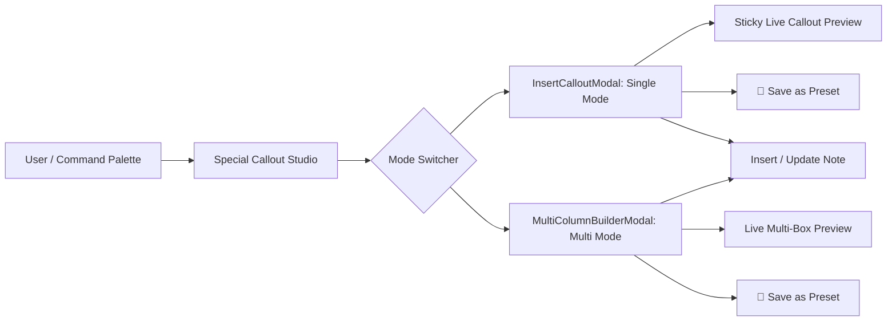

# Special Callout Studio & Visual Builders

## 1. Unified Studio Modal Architecture

Special Callouts provides an integrated modal system that allows users to switch seamlessly between **Single Callouts** and **Multi-Column Dashboards** without losing unsaved configurations.

---

## 2. Single Callout Studio (`InsertCalloutModal.ts`)

Located in [InsertCalloutModal.ts](file:///r:/Obsidian/Testsub1/.obsidian/plugins/special-callouts/src/modals/InsertCalloutModal.ts):

### Features & Workflow
1. **Sticky Live Preview**: Real-time rendering card reflecting all current color, border, typography, and flag configurations instantly.
2. **Four Tabbed Customization Sections**:
   - **Content**: Type selector (built-in + custom presets), Title, Body text with editor toolbar.
   - **Colors**: Background tint / gradient, Border color, Text color, Link color, Title & Icon colors.
   - **Icon & Font**: Lucide icon search picker, Font family selector, Font size scale (`1` to `5`), Icon visibility toggle.
   - **Borders & Style**: Border width (`1px` to `8px`), Border style (`solid`, `dashed`, `dotted`, `double`, `none`), Corner radius (`0px` to `24px`), Neon glow, Compact mode, Center alignment (`center` / `title:center`).
3. **💾 Save as Preset**: Save the current single callout configuration directly as a named preset into `customStyles` for reuse via `> [!my-preset]`.
4. **Existing Callout Detection**: Automatically detects when cursor is inside an existing callout and switches to "Edit Callout" mode, updating the note cleanly in-place.

---

## 3. Multi-Column Visual Grid Builder (`MultiColumnBuilderModal.ts`)

Located in [MultiColumnBuilderModal.ts](file:///r:/Obsidian/Testsub1/.obsidian/plugins/special-callouts/src/modals/MultiColumnBuilderModal.ts):

### Interactive Capabilities
1. **Dimension Selectors**: Configure dynamic grid matrices from $1 \times 2$ up to $6 \times 6$.
2. **Persistent Visual Matrix Canvas**:
   - Click and drag across grid cells to merge areas into spans.
   - Clicking boxes or preset templates keeps the user in layout mode until explicitly clicking **`✓ Done (Edit Box Content)`**.
   - Split / unmerge functionality and orphan area cleanup.
3. **Preset Template Palette**: Instant 1-click loading of predefined layouts (`Hero + 2 Cards`, `Header + Sidebar`, `3 Columns`, `2×2 Quad`, `Feature 3`).
4. **Per-Box Customization**:
   - Callout Type (`note`, `info`, `tip`, `warning`, `quote`, etc.).
   - Lucide Icon Picker with real-time search.
   - Background Color / Gradient, Border Color, Title & Icon Colors.
   - Neon glow, Radius, and Flags.
5. **💾 Save as Preset**: Save the entire multi-box layout into `customLayouts` for reuse across vault notes.

---

## 4. Markdown Editor Toolbar & Real-Time Suggesters

Inside modal text editing areas, [UIComponents.ts](file:///r:/Obsidian/Testsub1/.obsidian/plugins/special-callouts/src/ui/UIComponents.ts) provides a rich markdown editing toolbar:

- **Formatting Actions**: Bold (`**`), Italic (`*`), Code (`` ` ``), Links (`[[...]]`), Tags (`#...`), Lists (`- `).
- **Auto-Suggestions**:
  - Typing `[[` pops up vault note suggestions cached at the session level.
  - Typing `#` pops up tag suggestions.
- **Keyboard Shortcuts**: `Ctrl+B` (Bold), `Ctrl+I` (Italic), `Ctrl+K` (Wikilink).
