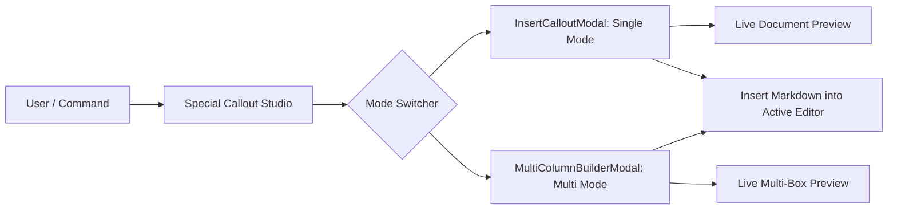

# Special Callout Studio & Visual Builders

## 1. Unified Studio Modal Architecture

Special Callouts provides an integrated modal system that allows users to switch seamlessly between **Single Callouts** and **Multi-Column Dashboards** without losing unsaved changes.

---

## 2. Multi-Column Visual Grid Builder

Located in [MultiColumnBuilderModal.ts](file:///r:/Obsidian/Testsub1/.obsidian/plugins/special-callouts/src/modals/MultiColumnBuilderModal.ts):

### Interactive Capabilities
1. **Dimension Selectors**: Configure grid size up to 6 columns $\times$ 6 rows.
2. **Visual Cell Matrix**: Click and drag across grid cells to merge areas into spans.
3. **Preset Palette**: Instant 1-click loading of predefined layouts (`Hero + 2 Cards`, `Header + Sidebar`, `3 Columns`).
4. **Per-Box Customization**:
   - Callout Type (`note`, `info`, `tip`, `warning`, `quote`, etc.).
   - Lucide Icon Picker with real-time search.
   - Background Color, Border Color, Title & Icon Colors.
   - Neon glow, Gradients, Radius, and Flags.

---

## 3. Markdown Editor Toolbar & Real-Time Suggesters

Inside modal text editing areas, [UIComponents.ts](file:///r:/Obsidian/Testsub1/.obsidian/plugins/special-callouts/src/ui/UIComponents.ts) provides a rich markdown editing toolbar:

- **Formatting Actions**: Bold (`**`), Italic (`*`), Code (`` ` ``), Links (`[[...]]`), Tags (`#...`), Lists (`- `).
- **Auto-Suggestions**:
  - Typing `[[` pops up vault note suggestions cached at the session level.
  - Typing `#` pops up tag suggestions.
- **Keyboard Shortcuts**: `Ctrl+B` (Bold), `Ctrl+I` (Italic), `Ctrl+K` (Wikilink).
